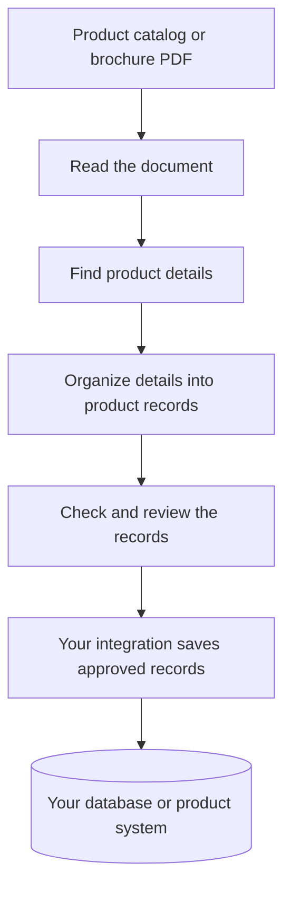

# Agentic Catalog Ingestion

Turn product catalogs and brochures into structured product records for your database.

## What is the problem?

A product brochure is made for people to read. It may contain dozens or hundreds of products, with names, product codes, prices, and other details spread across pages and tables.

But a database needs those details organized into separate fields. A PDF cannot simply be loaded as a collection of product records. Someone usually has to read the brochure and enter each product by hand.

## Why are we solving it?

Manual entry takes time, especially when a catalog contains many products. It is easy to miss a detail, copy a value into the wrong field, or enter the same product twice. When a new brochure arrives, the work starts again.

The aim is to reduce that repetitive work so people can spend their time checking product information instead of typing it.

## How are we trying to solve it?

The system reads a product catalog or brochure PDF, finds product information, and organizes it into a consistent structure—a set of named fields for each product.

It keeps references to the original document so the extracted details can be checked. Missing information should stay empty instead of being guessed. Once the records have been reviewed and mapped to your database's fields, your integration can save them without manually re-entering each product.

For example, a brochure entry such as **“Oak Chair · CH-101 · USD 85”** could become:

| Product code | Product name | Price | Currency |
| --- | --- | --- | --- |
| CH-101 | Oak Chair | 85 | USD |

This is an illustration of the idea; the [output guide](docs/outputs.md) explains the actual record structure.

### What works today?

The project can read PDFs and use AI to extract structured product information. It also includes checks and review handoffs. Image-based enrichment currently uses demonstration data.

Saving products to your database, PIM (Product Information Management), or CRM (Customer Relationship Management) system requires a custom integration. The project provides the extraction workflow; your integration handles field mapping, approval, and saving records.

## Guides

- [Get started](docs/getting-started.md): install the project and process your first PDF.
- [Understand the output](docs/outputs.md): see what product records and document references contain.
- [Connect your database, PIM, or CRM](docs/integrations.md): map, review, and save the extracted information using your own integration.
- [Explore the technical architecture](docs/architecture.md): detailed diagrams, processing steps, and current limitations.
