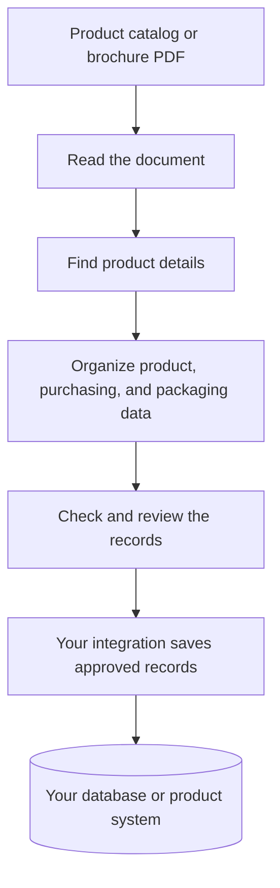

# Product Catalog Onboarding

Turn product catalogs and brochures into structured product, purchasing, and packaging records for your database, PIM, or ERP.

## What is the problem?

A product brochure is made for people to read. It may contain dozens or hundreds of products, with names, product codes, prices, and other details spread across pages and tables.

But a database needs those details organized into separate fields. A PDF cannot simply be loaded as a collection of product records. Someone usually has to read the brochure and enter each product by hand.

## Why are we solving it?

Manual entry takes time, especially when a catalog contains many products. It is easy to miss a detail, copy a value into the wrong field, or enter the same product twice. When a new brochure arrives, the work starts again.

The aim is to reduce that repetitive work so people can spend their time checking product information instead of typing it.

## How are we trying to solve it?

The system reads a product catalog or brochure PDF, extracts facts supported by the document, and organizes them into named fields. This is **product data onboarding**: preparing information from a document for use in your business systems.

The information falls into three groups:

| Data group | What it means |
| --- | --- |
| **Product Master Data** | Product identity and attributes, such as product code, name, and specifications. |
| **Commercial / Purchasing Data** | Quoted unit price, currency, minimum order quantity, and purchasing terms. These can vary by supplier or offer. |
| **Logistics / Packaging Data** | Packaging dimensions, cubic volume, and shipping quantities supported by the document. |

This **evidence-grounded extraction** keeps source-page and source-text references so records can be checked. Missing information should stay empty instead of being guessed; source units and currency are preserved. Once the records have been reviewed and mapped to your database's fields, your integration can save them without manually re-entering each product.

For example, a brochure entry such as **“Oak Chair · CH-101 · Quoted unit price: USD 85”** could become:

| Product code | Product name | Quoted unit price | Currency |
| --- | --- | --- | --- |
| CH-101 | Oak Chair | 85 | USD |

The code and name identify the product; the quoted price and currency belong to its commercial offer. This is an illustration of the idea; the [output guide](docs/outputs.md) explains the actual record structure.

### What works today?

The project implements document extraction, structured product and commercial extraction, and some data-quality checks. It returns review statuses for your application to handle.

**Extraction** recovers facts from the document. **Enrichment** adds descriptive or merchandising metadata using grounded product information and images. Image-based enrichment currently uses demonstration data; it does not supply missing prices or purchasing terms.

Saving records to your database, PIM, CRM, or ERP requires a custom integration. Your application handles field mapping, human review, approval, and synchronization. See the guides for implementation details and current limitations.

## A few useful terms

- **Product Master Data:** the product's identifying, descriptive, and technical attributes.
- **Supplier Item Master Data:** the supplier-specific representation of an item, with links to its purchasing and packaging information.
- **PPV:** a project-internal label used in extraction code and fields such as `ppv_results`. It covers product identity, commercial offers, and packaging; it is not a synonym for Product Master Data alone.
- **PIM / ERP:** Product Information Management / Enterprise Resource Planning—systems that manage product information and business operations.

The [glossary](docs/glossary.md) explains these terms, MOQ, CBM, source evidence, and the technologies used in the project.

## Guides

- [Get started](docs/getting-started.md): install the project and process your first PDF.
- [Understand the output](docs/outputs.md): see what product records and document references contain.
- [Read the glossary](docs/glossary.md): business terminology and internal code labels explained.
- [Connect your database, PIM, or CRM](docs/integrations.md): map, review, and save the extracted information using your own integration.
- [Explore the technical architecture](docs/architecture.md): detailed diagrams, processing steps, and current limitations.
