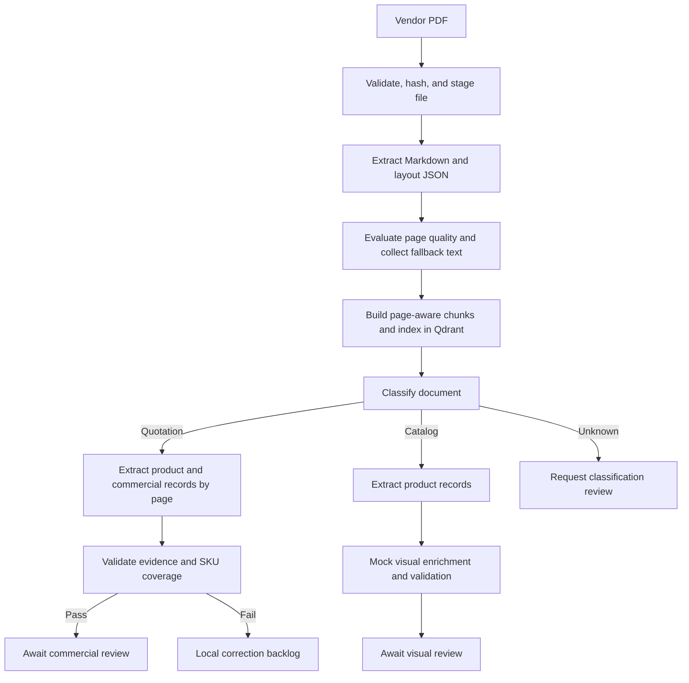
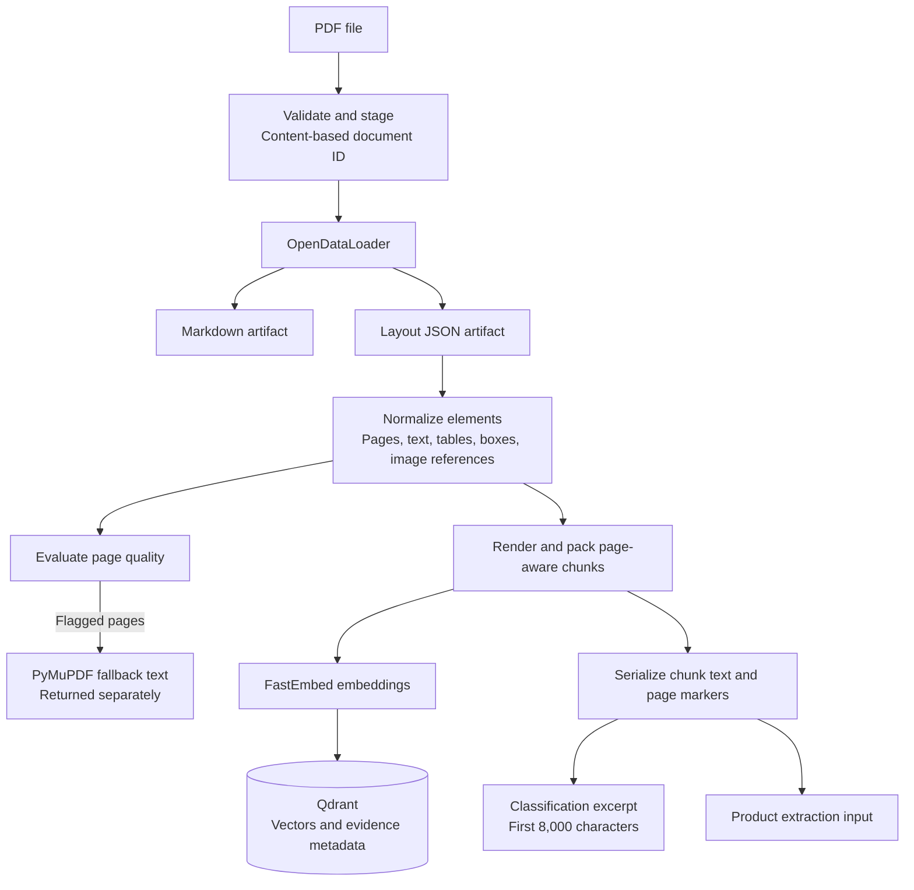
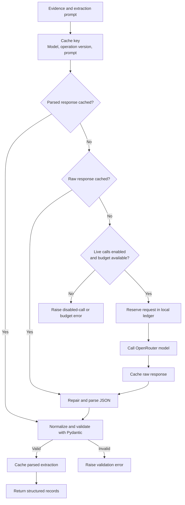
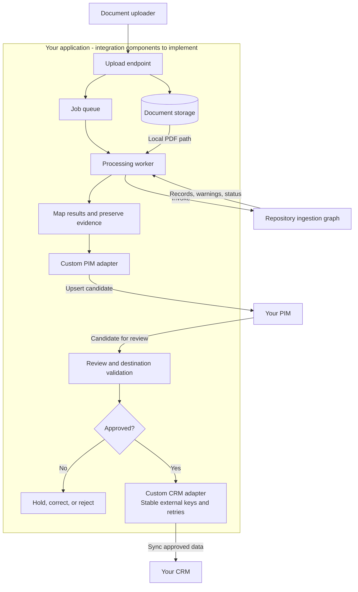
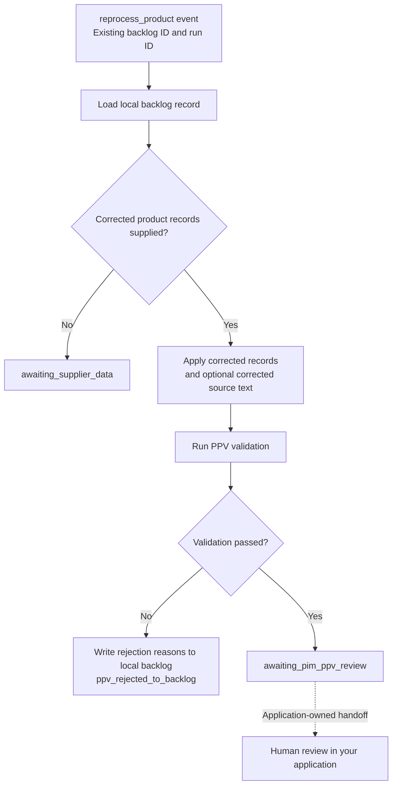

# Agentic Catalog Ingestion

A LangGraph-based pipeline for turning vendor PDF catalogs and quotations into structured product and commercial records, with source evidence and review workflows.

Vendor documents mix product identities, tables, prices, packaging details, and images in inconsistent layouts. This project extracts those documents into page-aware content, indexes that content in Qdrant, and uses an LLM to produce structured records for downstream review.

The guiding principle is to preserve what the document supports: keep missing values explicit, retain source text and page references, and separate factual extraction from visual enrichment.

This repository is a development implementation. PDF processing and LLM extraction are implemented; visual enrichment currently uses mock results. Proprietary PIM and Odoo implementations are outside the scope of this documentation. The integration guidance below describes how to connect your own PIM and CRM through application-owned adapters.

## How it works



1. **Import and extract.** Validate the PDF signature and size, derive a content-based document ID, and stage a local copy. OpenDataLoader produces Markdown and JSON; normalization preserves page numbers, layout bounding boxes, and image references.
2. **Prepare evidence.** Render document elements into page-aware chunks. Evaluate page quality and collect PyMuPDF fallback text for flagged pages. Fallback text is returned separately and is not yet merged into the chunks.
3. **Index.** Embed chunks with FastEmbed using `BAAI/bge-small-en` and upload them to Qdrant with document and page metadata. A search helper exists, but the extraction graph currently consumes document text directly rather than retrieving evidence from Qdrant.
4. **Route and extract.** Classify the first 8,000 characters using local rules or an optional LLM. Quotations are reassembled into page-level extraction units, with optional missing-SKU retries. Catalogs use the same structured extractor through a separate batching path.
5. **Validate and review.** Pydantic parses structured responses. The quotation branch additionally checks detected SKU/variant coverage, source-text consistency, and packaging evidence. Successful records await review; validation failures enter a local backlog. The catalog branch demonstrates visual review using fixed mock results.

Both extraction branches use OpenRouter through an OpenAI-compatible client. Raw and parsed responses are cached locally, and request limits bound uncached model calls.

### Document processing and evidence flow

The parser produces several representations of the same document. Chunks feed both indexing and extraction; fallback text remains a separate diagnostic output.



There is currently no Qdrant retrieval step between indexing and product extraction. Image references identify source assets; they do not establish verified product-to-image matches.

### Model requests and cache reuse

For product extraction, parsed responses are checked first, followed by cached raw responses. Only a cache miss reaches the request guard and provider.



Provider failures also propagate to the caller, and reserved requests still count toward the budget. Cached output must pass schema validation before it is returned.

## Quick start

### Requirements

- Python 3.12 or newer; the repository pins the local interpreter to 3.12.
- `uv` for dependency installation and execution.
- Java 11 or newer on `PATH` for the installed OpenDataLoader PDF parser.
- A PDF you are permitted to process, up to 100 MB with the default importer settings.
- For the full graph: a reachable Qdrant instance and OpenRouter credentials.

From the repository root:

```bash
uv sync
java -version
```

### Parse a PDF without Qdrant or LLM calls

Replace the example path with your PDF. This runs the document-processing layer and prints the generated artifact paths:

```bash
uv run python - <<'PY'
from src.document_pipeline import process_document

result = process_document(
    "data/source_pdfs/sample-catalog.pdf",
    index_in_qdrant=False,
)

print("Document:", result.imported_pdf.document_id)
print("Pages:", result.parsed_document.number_of_pages)
print("Chunks:", len(result.chunks))
print("Markdown:", result.parsed_document.markdown_path)
print("JSON:", result.parsed_document.json_path)
print("Fallback pages:", [page.page_number for page in result.fallback_pages])
PY
```

### Run the full workflow

Create a `.env` file in the repository root and replace the placeholders:

```dotenv
QDRANT_URL=https://your-qdrant-endpoint
QDRANT_API_KEY=your-qdrant-api-key
QDRANT_COLLECTION=catalog_chunks

OPENROUTER_API_KEY=your-openrouter-api-key
OPENROUTER_MODEL=your-model-id
ENABLE_LLM_CALLS=true
ENABLE_CLASSIFIER_LLM=false

MAX_LLM_REQUESTS_PER_RUN=3
MAX_LLM_REQUESTS_PER_DAY=20
```

The graph always enables Qdrant indexing for new documents, and its client requires both the URL and API key. Choose a model available to your OpenRouter account. Document text is sent to that provider during live extraction, and chunk text is stored in your configured Qdrant instance.

Invoke the graph from the repository root:

```bash
uv run python - <<'PY'
import json
from pathlib import Path
from uuid import uuid4

from src.workflow.catalog_graph import build_catalog_graph

final_state = build_catalog_graph().invoke({
    "event_type": "new_document",
    "run_id": str(uuid4()),
    "pdf_path": "data/source_pdfs/sample-catalog.pdf",
    "processing_status": "received",
    "warnings": [],
})

output = Path("data/output/result.json")
output.parent.mkdir(parents=True, exist_ok=True)
output.write_text(
    json.dumps(final_state, indent=2, ensure_ascii=False),
    encoding="utf-8",
)
print("Status:", final_state.get("processing_status"))
print("Result:", output)
PY
```

Alternatively, update `PDF_PATH` in [main.py](main.py) and run `uv run python main.py` for a console summary. The script has a local example path and does not accept a PDF command-line argument.

The three-request default suits small experiments. Larger documents may exceed it because quotations can require one or more calls per page. Cached responses are reused before checking the request budget; disabling live calls does not provide a mock product extractor.

### Configuration

| Variable | Default | Purpose |
| --- | --- | --- |
| `ENABLE_LLM_CALLS` | `false` | Allow uncached model requests. |
| `ENABLE_CLASSIFIER_LLM` | `false` | Use the LLM classifier instead of local rules. |
| `OPENROUTER_API_KEY` | Required for live calls | Authenticate model requests. |
| `OPENROUTER_MODEL` | See the extractor/classifier source | Override the model for both operations. |
| `MAX_LLM_REQUESTS_PER_RUN` | `3` | Request limit per guard instance. |
| `MAX_LLM_REQUESTS_PER_DAY` | `20` | Daily limit recorded in a local ledger. |
| `QDRANT_URL` / `QDRANT_API_KEY` | Required for indexing | Connect to Qdrant. |
| `QDRANT_COLLECTION` | `catalog_chunks` | Collection used for document chunks. |
| `PPV_MAX_ATTEMPTS_PER_PAGE` | `1` | Maximum quotation extraction attempts per page. |
| `PPV_MAX_OUTPUT_TOKENS` | `6000` | Output-token limit per extraction request. |
| `PPV_CACHE_VERSION` | `ppv-v1` | Namespace for extraction cache entries. |
| `CATALOG_EXTRACTION_BATCH_SIZE` | `3` | Requested number of chunks per catalog batch. |

The request guard is shared at module scope, so its “per-run” counter currently lasts for the process's guard instance, even across multiple graph invocations. The local ledger is not a distributed rate limiter.

## Outputs and evidence

The returned graph state contains product records under `ppv_results`, along with the document ID, chunk IDs, classification, processing status, and declared validation fields. Here, PPV refers to the product/commercial extraction stage. Each product can contain:

| Field | Meaning |
| --- | --- |
| `vendor_sku`, `vendor_product_name`, `variant` | Source product identity. |
| `source.page`, `source.raw_text` | Product-level source evidence. |
| `offers` | Price, currency, Incoterm, minimum quantity, and payment terms. |
| `packaging` | Packaging dimensions, unit, CBM, and container quantity. |
| `warnings`, `confidence` | Extraction uncertainty and review signals. |

See [the extraction models](src/llm/ppv_extractor.py) for the current schema. Packaging dimensions must not be treated as product dimensions. Evidence is currently represented at product level, rather than as independently verified provenance for every field.

Parser artifacts are written under `data/output/<document_id>/opendataloader/`; staged PDFs go under `data/input/`. Model caches and request accounting use `data/llm_cache/` and `data/runtime/`. The workflow returns its state in memory; the example above explicitly saves that state to JSON.

## Connect your own PIM and CRM

Treat ingestion as a service that produces **review candidates**. Your application owns authentication, field mapping, human approval, persistence, and downstream synchronization. No production PIM, CRM, or ERP connector is provided, and no proprietary endpoints, schemas, or synchronization logic are required to use the parser.

The following is a **proposed integration architecture**. Everything inside the application boundary is supplied by you; the PIM and CRM are shown only as external systems.



### 1. Wrap the graph in your processing service

Accept an upload in your application, retain its job and vendor identifiers, and make the PDF available as a local path to a worker. Invoke `build_catalog_graph().invoke(...)` with the `new_document` state shown above. Object-storage downloads, upload APIs, and queue consumers are integration work you supply.

Keep your application's tenant, vendor, and job identifiers in its own job record and associate them with the returned `document_id`. Arbitrary extra keys are not automatically preserved by the graph's typed state. Catch parsing, provider, budget, and extraction exceptions in your worker and record a failed or retryable job outcome.

### 2. Map results into PIM review candidates

Read `ppv_results` and preserve the source evidence, document/chunk references, and warnings alongside each candidate. Define an explicit mapping from the extraction schema into your PIM's product, variant, offer, and packaging fields.

Use your vendor identifier plus source SKU and variant to identify products where those fields are reliable. Keep document identity separately for provenance and import deduplication; it changes when the PDF content changes. Route records without a reliable identity to review. Preserve nulls and apply any unit or currency normalization in a separate, traceable step.

The current terminal statuses provide the following handoff points:

| `processing_status` | Action in your application |
| --- | --- |
| `awaiting_pim_ppv_review` | Create commercial review candidates; validation has not granted business approval. |
| `awaiting_pim_visual_review` | Create a visual review task; current `vlm_results` are mock data and must not be imported as real enrichment. |
| `ppv_rejected_to_backlog` | Surface validation reasons and request corrections. |
| `awaiting_supplier_data` | Keep the task pending until additional information is available. |
| `document_requires_review` | Request document classification or manual handling. |

These names are public workflow status strings. Reaching a review status does not call an external API or create a review task automatically.

Implement your connector outside the extraction layer. For example, the following is a **suggested interface to implement**, not an existing repository API:

```python
from typing import Any, Protocol


class PIMAdapter(Protocol):
    def upsert_review_candidate(
        self, *, external_key: str, candidate: dict[str, Any]
    ) -> str:
        """Persist a mapped candidate and return its PIM identifier."""
        ...


class CRMAdapter(Protocol):
    def sync_approved_record(
        self, *, external_key: str, record: dict[str, Any]
    ) -> str:
        """Persist approved, mapped data and return its CRM identifier."""
        ...
```

Your wrapper constructs `candidate` from the extracted product, document references, and application context before calling the PIM adapter. Use a local implementation that writes JSON while developing, then implement the same contract using your system's supported API or SDK.

### 3. Make approval explicit

Provide approve, edit, reject, and correction actions in your PIM or review application. Add destination-specific validation for required fields, numeric ranges, units, currency codes, and duplicate identities. Schema parsing and the graph's validation flags alone are insufficient approval criteria.

The graph supports correction reprocessing through `event_type="reprocess_product"`, an existing `backlog_id`, a `run_id`, and `corrected_ppv_results`, with optional `corrected_ppv_source_text`. This revalidates supplied corrections; it is not durable checkpoint resume. Your application must maintain the review decision and correction history.

The correction path reloads an existing local backlog record. Supplying corrected records triggers validation again; supplying only corrected source text leaves the workflow waiting for supplier data.



This path ends at a review status. Approval and downstream synchronization happen in the application you integrate.

### 4. Synchronize approved data to your CRM

Trigger your CRM adapter from the application's approval event. Decide which supported CRM entities should receive the data—for example, approved product references, supplier/account records, or quotation line items—and map them explicitly. A CRM's entity model may differ from the PIM's product model.

Store the association between PIM identifiers and CRM identifiers. Use stable external keys for create-or-update operations, track synchronization status separately from extraction and approval, and retry transient failures without creating duplicate records. Record destination validation errors for review. The same adapter boundary can support an ERP if your application needs one.

### 5. Verify the integration

Exercise your adapters with synthetic records covering approval, rejection, missing SKU, repeated delivery, corrected data, and destination failures. Confirm that unapproved candidates cannot trigger CRM writes and that retrying a successful synchronization updates the existing record. Keep credentials in your deployment's configuration and system-specific mappings in your integration package.

## Current limitations

- **Visual enrichment is a demonstration.** Fixed mock results are independent of the uploaded PDF. Live image interpretation, image quality processing, and verified image-to-product matching remain to be implemented.
- **State propagation needs further work.** Some node outputs, including `document_chunks` and `vendor_result`, are absent from `CatalogPipelineState`. They may be dropped by LangGraph. Quotations reconstruct chunks from serialized text; catalogs can fall back to the full document, so configured catalog batching is not guaranteed. Do not depend on vendor metadata being returned until those state fields are declared.
- **Validation is partial.** Catalog extraction does not pass through the quotation validation node. SKU detection is heuristic, and missing-SKU extraction can raise before backlog routing. Application validation and human review remain necessary.
- **Retrieval is not yet part of extraction.** The search helper has no document/tenant filter; add appropriate scoping before using it in a shared integration.
- **Production orchestration is external.** There is no bundled upload service, message broker consumer, durable graph checkpointer, review UI, or downstream synchronization worker. Local backlog and response caches do not provide complete job recovery or end-to-end idempotency.

## Code map

| Location | Responsibility |
| --- | --- |
| [main.py](main.py) | Example graph invocation and console summaries. |
| [src/document_pipeline.py](src/document_pipeline.py) | PDF import, parsing, quality evaluation, chunking, and indexing. |
| [src/extraction/](src/extraction/) | Document models, rendering, fallback parsing, and table reconstruction helpers. |
| [src/qdrant_index.py](src/qdrant_index.py) | Collection setup, embedding uploads, and search helper. |
| [src/llm/](src/llm/) | Classification, structured extraction, request caching, and mock visual enrichment. |
| [src/workflow/](src/workflow/) | LangGraph state, routing, validation, and review handoffs. |

Use synthetic or authorized documents for examples. Source PDFs, generated artifacts, and model caches may contain document content and should remain outside published examples.
