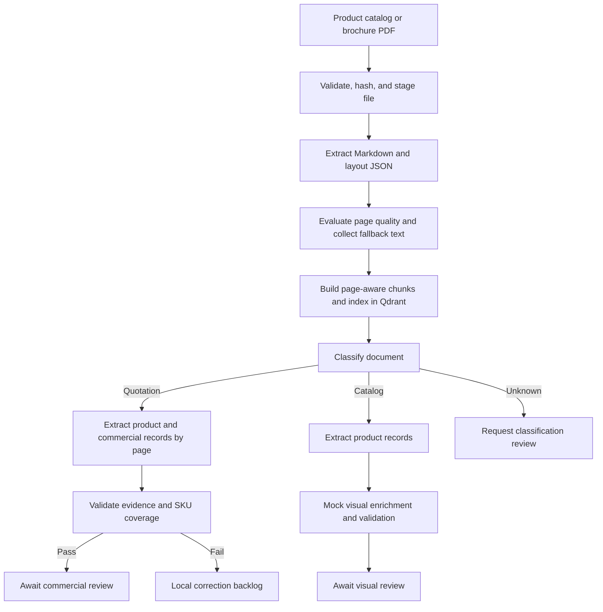
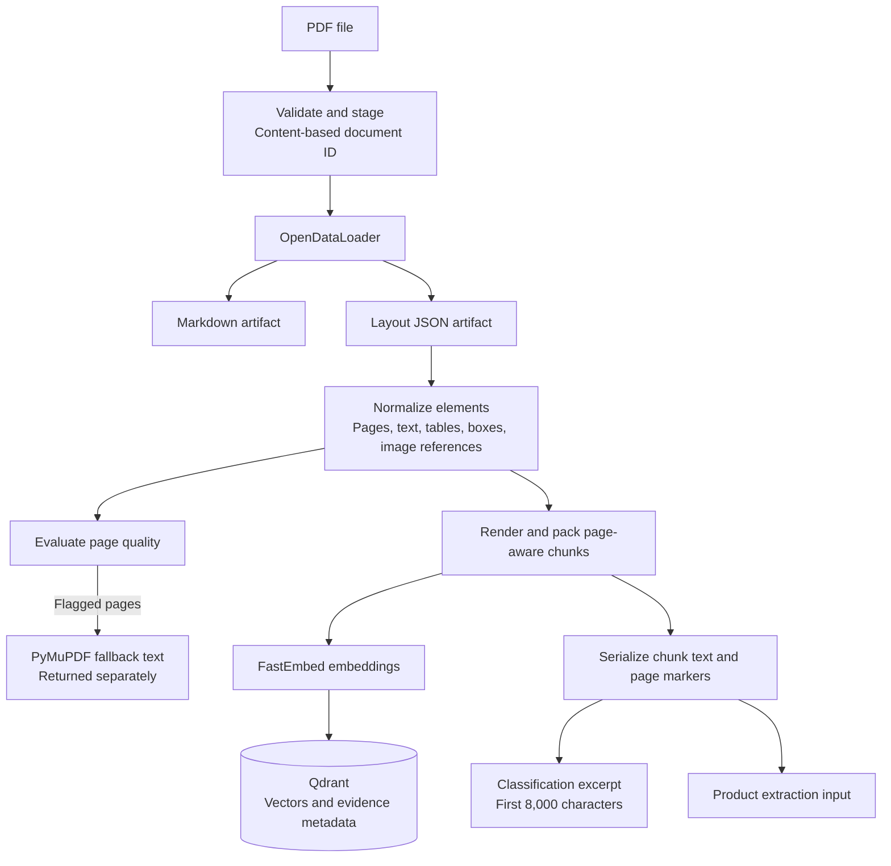
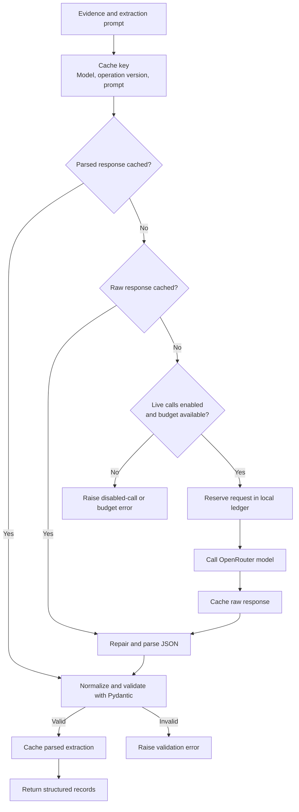

# Technical architecture

1. **Import and extract.** Validate the PDF signature and size, derive a content-based document ID, and stage a local copy. OpenDataLoader produces Markdown and JSON; normalization preserves page numbers, layout bounding boxes, and image references.
2. **Prepare evidence.** Render document elements into page-aware chunks. Evaluate page quality and collect PyMuPDF fallback text for flagged pages. Fallback text is returned separately and is not yet merged into the chunks.
3. **Index.** Embed chunks with FastEmbed using `BAAI/bge-small-en` and upload them to Qdrant with document and page metadata. A search helper exists, but the extraction graph currently consumes document text directly rather than retrieving evidence from Qdrant.
4. **Route and extract.** Classify the first 8,000 characters using local rules or an optional LLM. Quotations are reassembled into page-level extraction units, with optional missing-SKU retries. Catalogs use the same structured extractor through a separate batching path.
5. **Validate and review.** Pydantic parses structured responses. The quotation branch additionally checks detected SKU/variant coverage, source-text consistency, and packaging evidence. Successful records await review; validation failures enter a local backlog. The catalog branch demonstrates visual review using fixed mock results.

Both extraction branches use OpenRouter through an OpenAI-compatible client. Raw and parsed responses are cached locally, and request limits bound uncached model calls.

### Document processing and evidence flow

The parser produces several representations of the same document. Chunks feed both indexing and extraction; fallback text remains a separate diagnostic output.

There is currently no Qdrant retrieval step between indexing and product extraction. Image references identify source assets; they do not establish verified product-to-image matches.

### Model requests and cache reuse

For product extraction, parsed responses are checked first, followed by cached raw responses. Only a cache miss reaches the request guard and provider.

Provider failures also propagate to the caller, and reserved requests still count toward the budget. Cached output must pass schema validation before it is returned.

## Current limitations

- **Visual enrichment is a demonstration.** Fixed mock results are independent of the uploaded PDF. Live image interpretation, image quality processing, and verified image-to-product matching remain to be implemented.
- **State propagation needs further work.** Some node outputs, including `document_chunks` and extracted organization metadata, are absent from `CatalogPipelineState`. They may be dropped by LangGraph. Quotations reconstruct chunks from serialized text; catalogs can fall back to the full document, so configured catalog batching is not guaranteed. Do not depend on organization metadata being returned until those state fields are declared.
- **Validation is partial.** Catalog extraction does not pass through the quotation validation node. SKU detection is heuristic, and missing-SKU extraction can raise before backlog routing. Application validation and human review remain necessary.
- **Retrieval is not yet part of extraction.** The search helper has no document/tenant filter; add appropriate scoping before using it in a shared integration.
- **Production orchestration is external.** There is no bundled upload service, message broker consumer, durable graph checkpointer, review UI, or downstream synchronization worker. Local backlog and response caches do not provide complete job recovery or end-to-end idempotency.

## Code map

| Location | Responsibility |
| --- | --- |
| [main.py](../main.py) | Example graph invocation and console summaries. |
| [src/document_pipeline.py](../src/document_pipeline.py) | PDF import, parsing, quality evaluation, chunking, and indexing. |
| [src/extraction/](../src/extraction/) | Document models, rendering, fallback parsing, and table reconstruction helpers. |
| [src/qdrant_index.py](../src/qdrant_index.py) | Collection setup, embedding uploads, and search helper. |
| [src/llm/](../src/llm/) | Classification, structured extraction, request caching, and mock visual enrichment. |
| [src/workflow/](../src/workflow/) | LangGraph state, routing, validation, and review handoffs. |

Use synthetic or authorized documents for examples. Source PDFs, generated artifacts, and model caches may contain document content and should remain outside published examples.

[Back to the README](../README.md)
