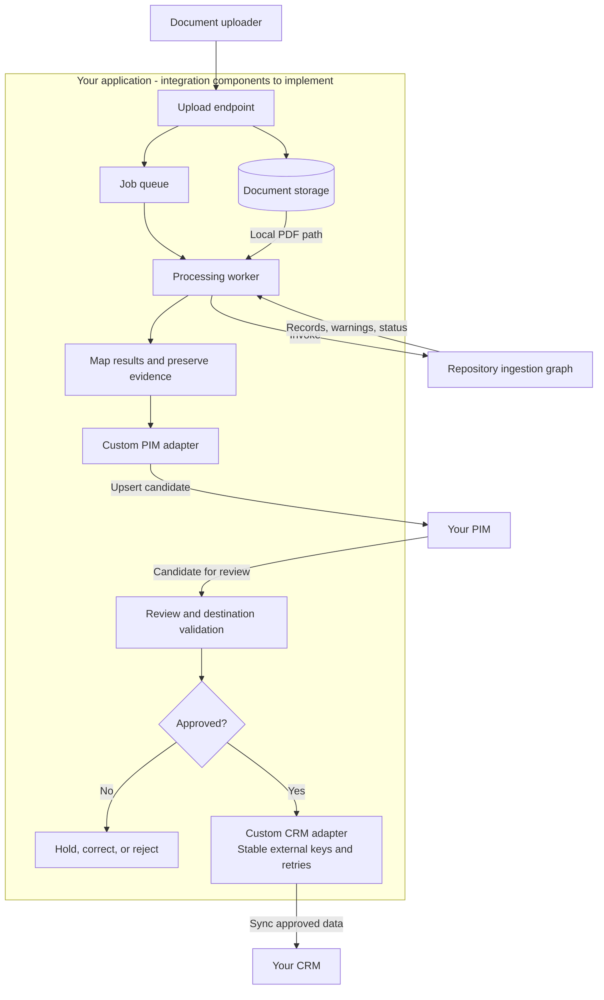
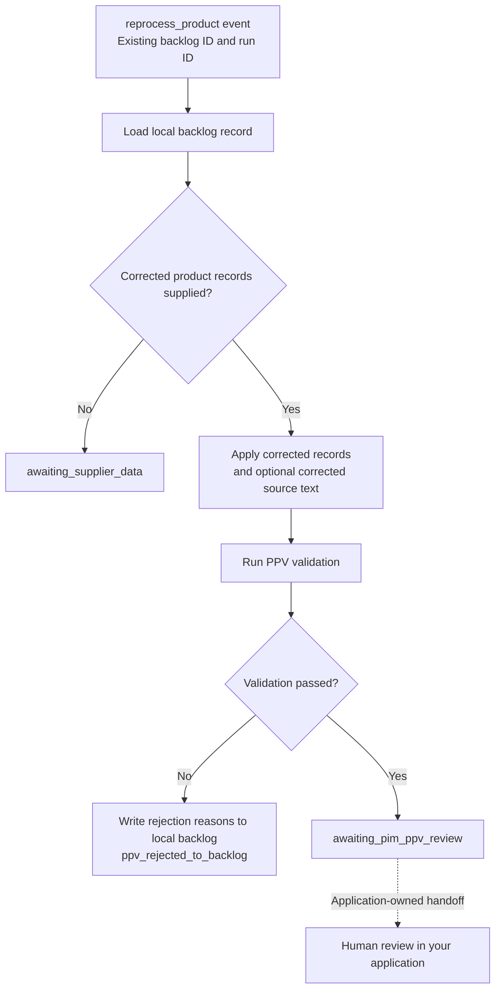

# Database, PIM, and CRM integration guide

Treat ingestion as a service that produces **review candidates**. Your application owns authentication, field mapping, human approval, persistence, and downstream synchronization. No production PIM, CRM, or ERP connector is provided, and no proprietary endpoints, schemas, or synchronization logic are required to use the parser.

The following is a **proposed integration architecture**. Everything inside the application boundary is supplied by you; the PIM and CRM are shown only as external systems.



## 1. Wrap the graph in your processing service

Accept an upload in your application, retain its job and source-organization identifiers, and make the PDF available as a local path to a worker. Invoke `build_catalog_graph().invoke(...)` with the `new_document` state in the [setup guide](getting-started.md). Object-storage downloads, upload APIs, and queue consumers are integration work you supply.

Keep your application's tenant, source-organization, and job identifiers in its own job record and associate them with the returned `document_id`. Arbitrary extra keys are not automatically preserved by the graph's typed state. Catch parsing, provider, budget, and extraction exceptions in your worker and record a failed or retryable job outcome.

## 2. Map results into PIM review candidates

Read `ppv_results` and preserve the source evidence, document/chunk references, and warnings alongside each candidate. Define an explicit mapping from the extraction schema into your PIM's product, variant, offer, and packaging fields.

Use your source-organization identifier plus source SKU and variant to identify products where those fields are reliable. Keep document identity separately for provenance and import deduplication; it changes when the PDF content changes. Route records without a reliable identity to review. Preserve nulls and apply any unit or currency normalization in a separate, traceable step.

The current terminal statuses provide the following handoff points:

| `processing_status` | Action in your application |
| --- | --- |
| `awaiting_pim_ppv_review` | Create commercial review candidates; validation has not granted business approval. |
| `awaiting_pim_visual_review` | Create a visual review task; current `vlm_results` are mock data and must not be imported as real enrichment. |
| `ppv_rejected_to_backlog` | Surface validation reasons and request corrections. |
| `awaiting_supplier_data` | Keep the task pending until additional information is available. |
| `document_requires_review` | Request document classification or manual handling. |

These names are public workflow status strings. Reaching a review status does not call an external API or create a review task automatically.

Implement your connector outside the extraction layer. For example, the following is a **suggested interface to implement**, not an existing repository API:

```python
from typing import Any, Protocol


class PIMAdapter(Protocol):
    def upsert_review_candidate(
        self, *, external_key: str, candidate: dict[str, Any]
    ) -> str:
        """Persist a mapped candidate and return its PIM identifier."""
        ...


class CRMAdapter(Protocol):
    def sync_approved_record(
        self, *, external_key: str, record: dict[str, Any]
    ) -> str:
        """Persist approved, mapped data and return its CRM identifier."""
        ...
```

Your wrapper constructs `candidate` from the extracted product, document references, and application context before calling the PIM adapter. Use a local implementation that writes JSON while developing, then implement the same contract using your system's supported API or SDK.

## 3. Make approval explicit

Provide approve, edit, reject, and correction actions in your PIM or review application. Add destination-specific validation for required fields, numeric ranges, units, currency codes, and duplicate identities. Schema parsing and the graph's validation flags alone are insufficient approval criteria.

The graph supports correction reprocessing through `event_type="reprocess_product"`, an existing `backlog_id`, a `run_id`, and `corrected_ppv_results`, with optional `corrected_ppv_source_text`. This revalidates supplied corrections; it is not durable checkpoint resume. Your application must maintain the review decision and correction history.

The correction path reloads an existing local backlog record. Supplying corrected records triggers validation again; supplying only corrected source text leaves the workflow waiting for supplier data.



This path ends at a review status. Approval and downstream synchronization happen in the application you integrate.

## 4. Synchronize approved data to your CRM

Trigger your CRM adapter from the application's approval event. Decide which supported CRM entities should receive the data—for example, approved product references, supplier/account records, or quotation line items—and map them explicitly. A CRM's entity model may differ from the PIM's product model.

Store the association between PIM identifiers and CRM identifiers. Use stable external keys for create-or-update operations, track synchronization status separately from extraction and approval, and retry transient failures without creating duplicate records. Record destination validation errors for review. The same adapter boundary can support an ERP if your application needs one.

## 5. Verify the integration

Exercise your adapters with synthetic records covering approval, rejection, missing SKU, repeated delivery, corrected data, and destination failures. Confirm that unapproved candidates cannot trigger CRM writes and that retrying a successful synchronization updates the existing record. Keep credentials in your deployment's configuration and system-specific mappings in your integration package.

## Write to your own database

If you use a database directly, implement the same review-candidate boundary in a database adapter. Map the extracted product fields to your tables or document schema, check required fields, and save approved records in a transaction. Use a stable product key for insert-or-update operations and keep document references for traceability. The repository does not currently include a database writer.

[Back to the README](../README.md)
